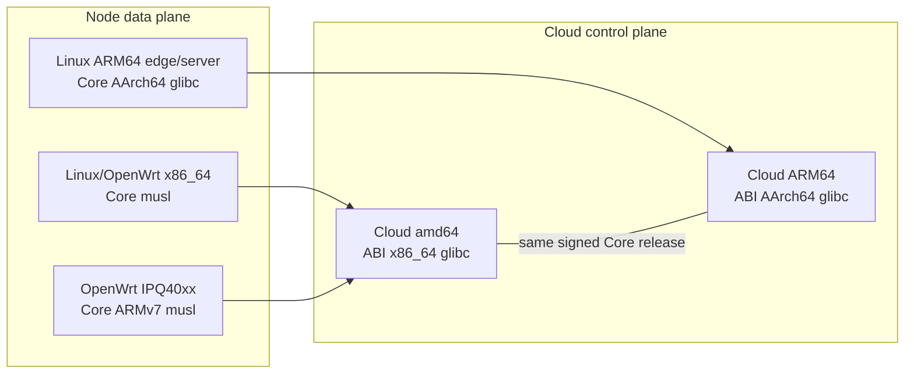

# Candy product and CPU architecture matrix

This document is the release boundary for the Candy product line. A platform
is marked supported only when its build, signed artifact, installer/runtime
selection, and release verification paths all exist. A compiler target alone
does not count as product support.

## Product boundaries

| Product | Repository | Deployable unit | Responsibility |
|---|---|---|---|
| Candy Core | `candy-core` | Signed `candy-core` executable and Cloud ABI library | QUIC/UDP data plane, Candy BBR, FEC, protocol, DNS/routing decisions, SD-WAN tunnel engine |
| Candy Runtime | `candy-runtime` | OpenWrt APK or Linux Runtime tarball | Service lifecycle, fail-open, Core installation/rollback, Cloud enrollment and synchronization |
| Candy Cloud | `candy-cloud` | Architecture-specific Docker image bundle | SaaS identity, API, authorization, topology orchestration, telemetry and web console |
| Candy Release | `candy-release` | Signed stable catalog and immutable Releases | Central artifact verification, signing policy and update discovery |
| LuCI app | `candy-runtime` | `luci-app-candy` APK | OpenWrt user interface and local diagnostics |
| Candy Android | `candy-android` | Android application/APK | Mobile client; release lifecycle is independent of the SD-WAN appliance line |
| Meta Core | `candy-meta-core` | Legacy compatibility builds | Compatibility codebase, not a dependency of the current Core/Runtime/Cloud release path |

## Released support as of 2026-08-18

| Component | x86_64 / amd64 | ARMv7 / IPQ40xx | ARM64 / aarch64 |
|---|---|---|---|
| Core data plane `0.3.12` | Supported, musl | Supported, musleabihf | Not released |
| Core Cloud ABI `0.3.12` | Supported, glibc | Not applicable | Not released |
| OpenWrt Runtime `0.4.0-r37` | Supported, OpenWrt 25.12.4 x86/64 | Supported, IPQ40xx Cortex-A7 | Not released |
| Linux Runtime `0.4.0-r37` | Supported, musl | Not released | Supported, glibc; Core dependency missing in `0.3.12` |
| Candy Cloud image | Supported by current x86 image Release | Not supported | Not released |
| LuCI | Supported with x86_64 Runtime | Supported with IPQ40xx Runtime | Not released |
| Android | Supported ABI | Supported ABI (`armeabi-v7a`) | Supported ABI (`arm64-v8a`) |

The Linux ARM64 Runtime is therefore only a partial product path in the current
stable channel: its package exists, but it cannot activate the data plane until
a matching signed ARM64 Core exists.

The next unified Core candidate is intentionally listed separately below. It is
not stable support until the local signing step and the `candy-release`
finalizer publish one immutable `core-v0.3.13` Release.

## `0.3.13` target matrix

| Role | Rust target | OS/libc | Consumers | Status in source |
|---|---|---|---|---|
| Core data plane | `x86_64-unknown-linux-musl` | Linux/musl | OpenWrt x86_64, Linux x86_64 | Existing |
| Core data plane | `armv7-unknown-linux-musleabihf` | Linux/musl | OpenWrt IPQ40xx | Existing |
| Core data plane | `aarch64-unknown-linux-gnu` | Linux/glibc | Linux ARM64 server/edge nodes | Added for `0.3.13` |
| Core Cloud ABI | `x86_64-unknown-linux-gnu` | Linux/glibc | Cloud amd64 images | Existing |
| Core Cloud ABI | `aarch64-unknown-linux-gnu` | Linux/glibc | Cloud ARM64 images | Added for `0.3.13` |
| Cloud services | `x86_64-unknown-linux-gnu` | Debian Bookworm | Cloud amd64 image bundle | Existing |
| Cloud services | `aarch64-unknown-linux-gnu` | Debian Bookworm | Cloud ARM64 image bundle | Added |

The candidate therefore has five native build targets: three data-plane
executables and two Cloud ABI libraries. Runtime and Cloud must select the
target from the host architecture; they must never install an x86_64 artifact
on an AArch64 host.

## Release completion criteria

ARM64 is considered supported only after all of the following are true:

1. `core-v0.3.13` contains three signed data-plane targets and two signed Cloud ABI targets.
2. `candy-release` verifies all five native targets and publishes both ARM64 records in the stable catalog.
3. Candy Cloud publishes `cloud-arm64-<commit>` from the signed `core-v0.3.13` ABI asset.
4. The ARM64 bundle runs natively on `47.83.1.189` without QEMU and preserves the existing MySQL volumes and secrets.
5. Linux Runtime installs and activates the `aarch64-unknown-linux-gnu` Core on an ARM64 node.
6. Cloud readiness, identity/login, topology publication, telemetry, Core ABI load, and SD-WAN synchronization pass end-to-end.

OpenWrt ARM64 is intentionally not claimed by this change. It needs a named
OpenWrt target/profile, SDK package build, device test baseline, and LuCI APK
before it can be added to the supported matrix.
